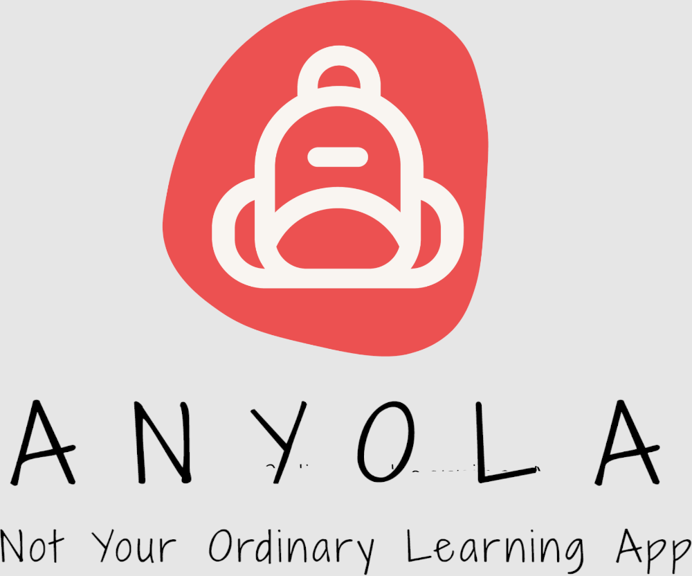

<h1 align="center">
  <br>
  </a>
  <br>
</h1>
<h2>Welcome to the ANYOLA Project. A one of its kind learning plattform.</h2>

---
## Description of the repository
The repository on hands is threefold indicated by the three folders in the root directory:
- The frontend folder contains the necessary code to run our demo application
- The backend folder contains a very basic setup for a Flask backend which will be used in the future. It is NOT necessary for the demo purpose.
- The game contains a subtask of the learning platform (Task 6 of the Amelia learn project) following a gamified learning approach. In the future this may be implemented within the frontend framework.

## Instructions on how to run the ANYOLA platform natively in Debug mode
As a prerequisite we require a running version of nodejs as well as the yarn package manager. We want to emphasize that for Lighthouse PWA testing it usually requires building and serving the project instead of running the development server. 
```
cd frontend
yarn install
yarn start
http://localhost:3000/ serves the plattform
```
## Instructions on how to run the flight game
```
cd game
yarn install 
yarn start
http://localhost:8080/ serves the game
```
## Use deployed versions.
We have deployed the frontend and the game on the Google cloud so that you can test the exerience right away. Use the following two links to access the current version of the project:
- ANYOLA platform: https://frontend-wx4j3ovcla-uc.a.run.app
- Amelia Game: https://anyolaamelia-wx4j3ovcla-uc.a.run.app